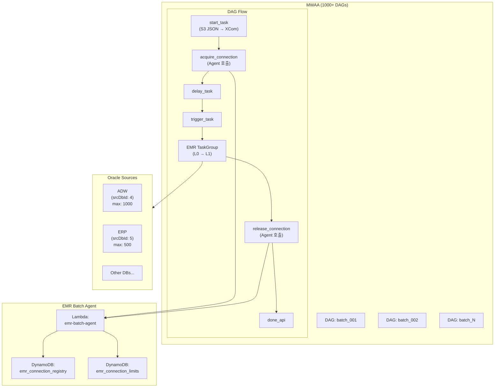
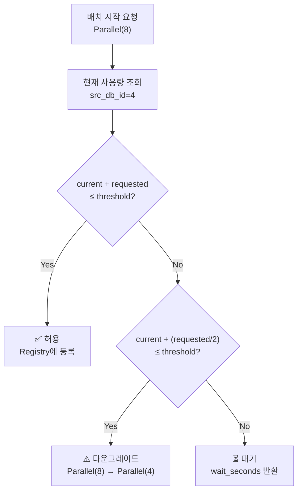

# EMR Batch Agent - Oracle Connection Pool 관리

## Overview

EMR Batch Agent는 MWAA에서 실행되는 1000개 이상의 일일 배치 작업에서 **Oracle Connection 고갈로 인한 장애를 미연에 방지**하는 서브 에이전트입니다. 각 배치의 Parallel 힌트 값을 추적하고, 원천 DB별 Connection 사용량을 실시간으로 관리하여 안정적인 배치 운영을 지원합니다.

### 문제 정의

| 항목 | 상세 |
|------|------|
| **배치 규모** | 매일 1000개 이상, 00:00 ~ 09:00 집중 실행 |
| **원천 구조** | Oracle DB에서 EMR Spark로 데이터 추출 |
| **Parallel 힌트** | `/*+ PARALLEL(8) FULL(A) */` 형태로 병렬 추출 |
| **문제 상황** | 동시 실행 배치 증가 → Connection 총합 초과 → 배치 실패 |
| **장애 빈도** | Peak 시간대(01:00~03:00) 빈번 발생 |

### 핵심 기능

- **Connection Pool Tracking**: 원천 DB별 실시간 Connection 사용량 추적
- **Admission Control**: 신규 배치 시작 전 Connection 여유분 확인
- **Dynamic Hint Adjustment**: Connection 부족 시 Parallel 값 동적 조정
- **Queue Management**: 대기열 관리 및 순차 실행

## Architecture



## 배치 스펙 JSON 구조

Portal에서 배포 시 S3에 저장되는 JSON 구조:

```json
{
  "athenaMetaData": {
    "athenaMetaId": 323,
    "srcDbId": 4,
    "srcDbTp": "oracle",
    "tableName": "SALES_ORDER",
    ...
  },
  "rsrcSpecData": {
    "rsrcSpecId": 76,
    "athenaMetaId": 323,
    "hint": "/*+ PARALLEL(8) FULL(A) */",
    "prttCnt": 3,
    "prttCol": "Col1",
    "ftchSz": 1000,
    ...
  }
}
```

### 핵심 필드

| 필드 | 경로 | 설명 | 예시 |
|------|------|------|------|
| **srcDbId** | `athenaMetaData.srcDbId` | 원천 DB 식별자 | `4` (ADW) |
| **srcDbTp** | `athenaMetaData.srcDbTp` | 원천 DB 타입 | `oracle` |
| **hint** | `rsrcSpecData.hint` | Oracle Parallel 힌트 | `/*+ PARALLEL(8) FULL(A) */` |

## Lambda: emr-batch-agent

| 속성 | 값 |
|------|-----|
| **Function** | `emr-batch-agent` |
| **Runtime** | Python 3.12 |
| **Architecture** | ARM64 (Graviton2) |
| **Memory** | 256MB |
| **Timeout** | 30s |
| **Trigger** | MWAA DAG (LambdaInvokeFunctionOperator) |

### API Endpoints

#### POST /acquire

배치 시작 시 Connection 예약 요청

**Request:**
```json
{
  "action": "acquire",
  "dag_id": "batch_001",
  "dag_run_id": "batch_001_2024-01-25T00:05:00",
  "src_db_id": 4,
  "parallel_hint": 8,
  "table_name": "SALES_ORDER"
}
```

**Response (Success):**
```json
{
  "allowed": true,
  "current_usage": 72,
  "after_usage": 80,
  "available": 920
}
```

**Response (Wait):**
```json
{
  "allowed": false,
  "reason": "connection_limit_exceeded",
  "current_usage": 995,
  "requested": 8,
  "wait_seconds": 30,
  "queue_position": 5
}
```

**Response (Downgrade):**
```json
{
  "allowed": true,
  "downgraded": true,
  "original_parallel": 16,
  "adjusted_parallel": 8,
  "reason": "partial_capacity_available"
}
```

#### POST /release

배치 종료 시 Connection 반환

**Request:**
```json
{
  "action": "release",
  "dag_id": "batch_001",
  "dag_run_id": "batch_001_2024-01-25T00:05:00",
  "src_db_id": 4
}
```

**Response:**
```json
{
  "released": true,
  "released_connections": 8,
  "current_usage": 72
}
```

#### GET /status

현재 Connection 사용 현황 조회

**Response:**
```json
{
  "sources": {
    "4": {
      "name": "ADW",
      "max_connections": 1000,
      "threshold": 950,
      "current_usage": 720,
      "available": 230,
      "active_batches": 85,
      "waiting_batches": 3
    },
    "5": {
      "name": "ERP",
      "max_connections": 500,
      "threshold": 450,
      "current_usage": 320,
      "available": 130,
      "active_batches": 42,
      "waiting_batches": 0
    }
  },
  "timestamp": "2024-01-25T02:30:00Z"
}
```

## DynamoDB 테이블 설계

### emr_connection_registry

실행 중인 배치의 Connection 점유 정보

| Attribute | Type | Description |
|-----------|------|-------------|
| **src_db_id** (PK) | Number | 원천 DB 식별자 |
| **dag_run_id** (SK) | String | DAG 실행 ID |
| dag_id | String | DAG 이름 |
| table_name | String | 대상 테이블명 |
| parallel_hint | Number | Parallel 값 (Connection 수) |
| status | String | RUNNING / WAITING / COMPLETED / FAILED |
| started_at | String | 시작 시간 (ISO 8601) |
| ttl | Number | TTL (24시간 후 자동 삭제) |

**Example:**
```json
{
  "src_db_id": 4,
  "dag_run_id": "batch_001_2024-01-25T00:05:00",
  "dag_id": "batch_001",
  "table_name": "SALES_ORDER",
  "parallel_hint": 8,
  "status": "RUNNING",
  "started_at": "2024-01-25T00:05:30Z",
  "ttl": 1706227530
}
```

### emr_connection_limits

원천 DB별 Connection 제한 설정

| Attribute | Type | Description |
|-----------|------|-------------|
| **src_db_id** (PK) | Number | 원천 DB 식별자 |
| name | String | 원천 DB 이름 |
| db_type | String | DB 타입 (oracle, mysql, ...) |
| max_connections | Number | 최대 Connection 수 |
| threshold_percent | Number | 임계치 (%, 기본 95) |
| default_parallel | Number | 기본 Parallel 값 |
| min_parallel | Number | 최소 Parallel 값 (다운그레이드 한계) |

**Example:**
```json
{
  "src_db_id": 4,
  "name": "ADW",
  "db_type": "oracle",
  "max_connections": 1000,
  "threshold_percent": 95,
  "default_parallel": 8,
  "min_parallel": 2
}
```

## Admission Control 로직

### 판단 흐름



### 알고리즘

```python
def check_admission(src_db_id: int, requested_parallel: int) -> AdmissionResult:
    # 1. 현재 사용량 조회
    current_usage = get_current_usage(src_db_id)

    # 2. 제한 조회
    limits = get_limits(src_db_id)
    threshold = limits.max_connections * limits.threshold_percent / 100

    # 3. 판단
    if current_usage + requested_parallel <= threshold:
        # Case 1: 여유 있음 → 바로 허용
        return AdmissionResult(
            allowed=True,
            parallel=requested_parallel
        )

    # 다운그레이드 시도 (절반씩 줄여가며)
    adjusted = requested_parallel
    while adjusted >= limits.min_parallel:
        adjusted = adjusted // 2
        if current_usage + adjusted <= threshold:
            # Case 2: 다운그레이드 후 허용
            return AdmissionResult(
                allowed=True,
                parallel=adjusted,
                downgraded=True,
                original_parallel=requested_parallel
            )

    # Case 3: 대기 필요
    wait_time = estimate_wait_time(src_db_id, requested_parallel)
    return AdmissionResult(
        allowed=False,
        wait_seconds=wait_time,
        queue_position=get_queue_position(src_db_id)
    )
```

### 대기 시간 추정

```python
def estimate_wait_time(src_db_id: int, needed: int) -> int:
    """
    예상 대기 시간 계산
    - 현재 실행 중인 배치들의 평균 잔여 시간 기반
    - 최소 30초, 최대 300초
    """
    running_batches = get_running_batches(src_db_id)

    # 가장 빨리 끝날 것 같은 배치 기준
    avg_remaining = calculate_avg_remaining_time(running_batches)

    return min(max(avg_remaining, 30), 300)
```

## MWAA DAG 수정

### 현재 구조

```python
start_task >> delay_task >> trigger_task >> emr_taskgroup >> done_api
```

### 변경 구조

```python
start_task >> acquire_connection >> delay_task >> trigger_task >> emr_taskgroup >> release_connection >> done_api
```

### 추가 Task 정의

```python
from airflow.decorators import task
from airflow.providers.amazon.aws.operators.lambda_function import LambdaInvokeFunctionOperator
import json
import time

# Connection 획득 Task
@task
def acquire_connection(**context):
    """
    EMR Batch Agent에 Connection 예약 요청.
    허용될 때까지 대기하거나, 다운그레이드된 hint를 반환.
    """
    ti = context['ti']
    spec = ti.xcom_pull(task_ids='start_task', key='batch_spec')

    src_db_id = spec['athenaMetaData']['srcDbId']
    hint = spec['rsrcSpecData'].get('hint', '')
    parallel = parse_parallel_hint(hint)  # "/*+ PARALLEL(8) */" → 8

    lambda_client = boto3.client('lambda')

    max_retries = 20
    for attempt in range(max_retries):
        response = lambda_client.invoke(
            FunctionName='emr-batch-agent',
            Payload=json.dumps({
                'action': 'acquire',
                'dag_id': context['dag'].dag_id,
                'dag_run_id': context['run_id'],
                'src_db_id': src_db_id,
                'parallel_hint': parallel,
                'table_name': spec['athenaMetaData'].get('tableName', 'unknown')
            })
        )

        result = json.loads(response['Payload'].read())

        if result['allowed']:
            # 다운그레이드된 경우 XCom에 저장
            if result.get('downgraded'):
                ti.xcom_push(key='adjusted_parallel', value=result['adjusted_parallel'])
            return result

        # 대기 후 재시도
        wait_seconds = result.get('wait_seconds', 30)
        time.sleep(wait_seconds)

    raise Exception(f"Connection 획득 실패: {max_retries}회 시도 후 타임아웃")


# Connection 반환 Task
release_connection = LambdaInvokeFunctionOperator(
    task_id='release_connection',
    function_name='emr-batch-agent',
    payload=json.dumps({
        'action': 'release',
        'dag_id': '{{ dag.dag_id }}',
        'dag_run_id': '{{ run_id }}',
        'src_db_id': "{{ ti.xcom_pull(task_ids='start_task', key='batch_spec')['athenaMetaData']['srcDbId'] }}"
    }),
    trigger_rule='all_done',  # 성공/실패 상관없이 항상 반환
)


def parse_parallel_hint(hint: str) -> int:
    """
    Oracle Parallel 힌트에서 숫자 추출.

    Examples:
        "/*+ PARALLEL(8) FULL(A) */" → 8
        "/*+ PARALLEL(16) */" → 16
        "" or None → 1
    """
    import re
    if not hint:
        return 1

    match = re.search(r'PARALLEL\s*\(\s*(\d+)\s*\)', hint, re.IGNORECASE)
    if match:
        return int(match.group(1))
    return 1
```

### 다운그레이드된 hint 적용 (EMR Step)

```python
# EMR TaskGroup 내에서 다운그레이드된 parallel 값 사용
@task
def submit_emr_step(**context):
    ti = context['ti']
    spec = ti.xcom_pull(task_ids='start_task', key='batch_spec')

    # Agent가 다운그레이드한 경우 해당 값 사용
    adjusted_parallel = ti.xcom_pull(task_ids='acquire_connection', key='adjusted_parallel')

    if adjusted_parallel:
        # hint 오버라이드
        original_hint = spec['rsrcSpecData'].get('hint', '')
        new_hint = re.sub(
            r'PARALLEL\s*\(\s*\d+\s*\)',
            f'PARALLEL({adjusted_parallel})',
            original_hint
        )
        # EMR Step에 오버라이드 전달
        step_config['hint_override'] = new_hint
```

## 환경 변수

| Variable | Description | Default |
|----------|-------------|---------|
| `EMR_AGENT_TABLE_REGISTRY` | Connection Registry 테이블명 | `emr_connection_registry` |
| `EMR_AGENT_TABLE_LIMITS` | Connection Limits 테이블명 | `emr_connection_limits` |
| `DEFAULT_THRESHOLD_PERCENT` | 기본 임계치 (%) | `95` |
| `DEFAULT_WAIT_SECONDS` | 기본 대기 시간 (초) | `30` |
| `MAX_WAIT_SECONDS` | 최대 대기 시간 (초) | `300` |
| `DEFAULT_PARALLEL` | hint 없을 때 기본값 | `1` |
| `MIN_PARALLEL` | 다운그레이드 최소값 | `2` |

## 모니터링 메트릭

### CloudWatch Metrics

| Metric | Description | Unit |
|--------|-------------|------|
| `ConnectionUsage` | 원천 DB별 현재 Connection 사용량 | Count |
| `ConnectionUtilization` | Connection 사용률 (%) | Percent |
| `AcquireRequests` | acquire 요청 수 | Count |
| `AcquireAllowed` | 즉시 허용된 요청 수 | Count |
| `AcquireDowngraded` | 다운그레이드 후 허용된 요청 수 | Count |
| `AcquireWaited` | 대기 후 허용된 요청 수 | Count |
| `AcquireTimeout` | 타임아웃 실패 수 | Count |
| `AvgWaitTime` | 평균 대기 시간 | Seconds |
| `QueueLength` | 대기열 길이 | Count |

### 알람 설정

| Alarm | Condition | Action |
|-------|-----------|--------|
| `HighConnectionUsage` | Utilization > 90% (5분 지속) | SNS 알림 |
| `LongQueueTime` | AvgWaitTime > 120초 | SNS 알림 |
| `AcquireTimeouts` | Timeout > 5/분 | SNS 알림 + 에스컬레이션 |

### 대시보드

```
┌─────────────────────────────────────────────────────────────────┐
│  EMR Batch Agent - Connection Pool Dashboard                    │
├─────────────────────────────────────────────────────────────────┤
│                                                                 │
│  [ADW (srcDbId: 4)]                    [ERP (srcDbId: 5)]      │
│  ████████████████████░░░░ 720/1000     ████████████░░░░ 320/500 │
│  72% utilization                       64% utilization          │
│  Active: 85 batches                    Active: 42 batches       │
│  Waiting: 3                            Waiting: 0               │
│                                                                 │
│  [Connection Usage Over Time - 24h Graph]                       │
│  ▁▂▃▅▇█████████▇▅▃▂▁▁▁▁▁▁▁▁▁▁▂▃▅▇█████                         │
│  00:00        06:00        12:00        18:00        24:00      │
│                                                                 │
│  [Recent Events]                                                │
│  02:30:15 - batch_421 downgraded: PARALLEL(16) → PARALLEL(8)   │
│  02:28:45 - batch_398 waited 45s before acquire                 │
│  02:25:00 - Peak usage: 892 connections (ADW)                   │
│                                                                 │
└─────────────────────────────────────────────────────────────────┘
```

## 프로젝트 구조

```
src/agents/emr/
├── __init__.py
├── handler.py                      # Lambda 핸들러
├── services/
│   ├── __init__.py
│   ├── connection_registry.py      # DynamoDB Registry CRUD
│   ├── connection_limits.py        # DynamoDB Limits CRUD
│   ├── hint_parser.py              # Parallel 힌트 파싱
│   └── admission_controller.py     # 입장 제어 로직
├── models/
│   ├── __init__.py
│   ├── batch_registration.py       # 배치 등록 모델
│   └── admission_result.py         # 입장 결과 모델
└── prompts/
    └── emr_analysis.py             # (Optional) LLM 분석 프롬프트
```

## 구현 순서

| Phase | 작업 | 예상 |
|-------|------|------|
| **Phase 1** | DynamoDB 테이블 생성 + 기본 Lambda | 1주 |
| **Phase 2** | MWAA DAG 템플릿 수정 | 1주 |
| **Phase 3** | 다운그레이드 로직 + EMR hint 오버라이드 | 1주 |
| **Phase 4** | 모니터링 대시보드 + 알람 | 1주 |
| **Phase 5** | 실 환경 적용 + 튜닝 | 2주 |

## 기대 효과

| Before | After |
|--------|-------|
| Peak 시간대 Connection 초과 장애 빈번 | Connection 사용량 사전 제어로 장애 예방 |
| 장애 발생 후 수동 재실행 | 자동 대기 + 재시도로 무중단 처리 |
| 전체 배치 실패 | 다운그레이드로 느리지만 성공 보장 |
| 원인 파악 어려움 | 실시간 대시보드로 상황 가시화 |

## 향후 확장

- **Priority Queue**: 중요 배치 우선 실행
- **Historical Learning**: 과거 패턴 기반 스케줄 최적화
- **Auto-Scaling Integration**: EMR 클러스터 자동 스케일링 연동
- **Circuit Breaker**: 원천 DB 장애 시 해당 배치 일괄 중지

## 관련 문서

- [Architecture Guide](ARCHITECTURE.md) - 전체 시스템 아키텍처
- [HDSP Detection](HDSP_DETECTION.md) - On-Prem K8s 장애 감지
- [Cost Anomaly Detection](COST_ANOMALY_DETECTION.md) - 비용 이상 탐지
- [Config Drift Detection](CONFIG_DRIFT_DETECTION.md) - 설정 드리프트 감지
