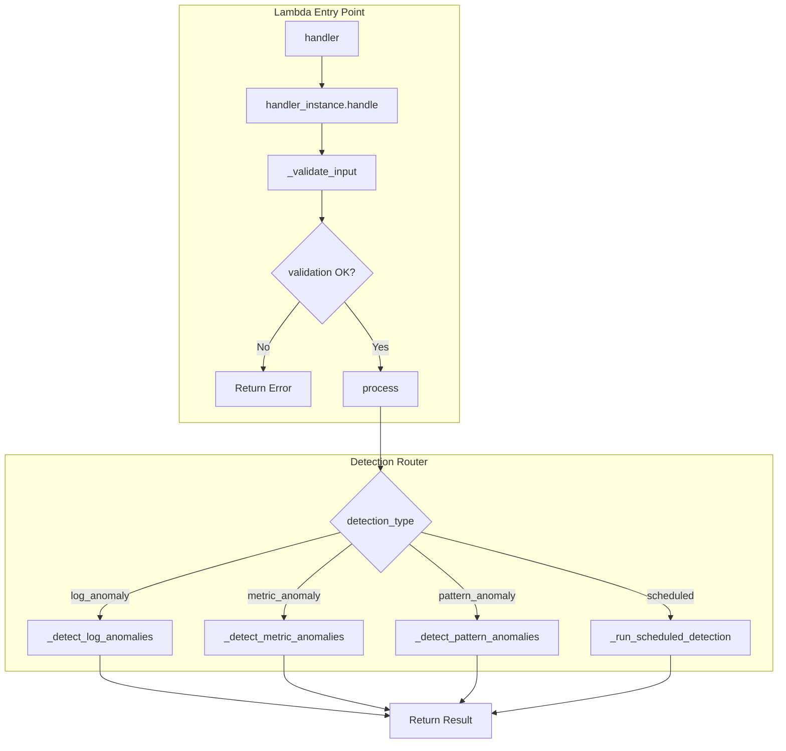
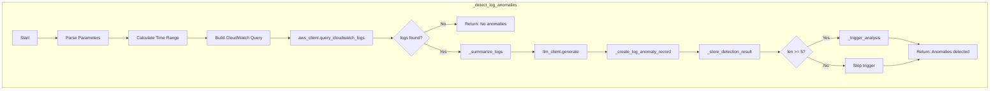
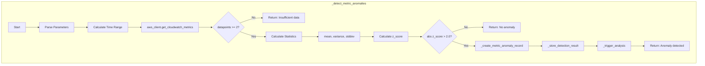
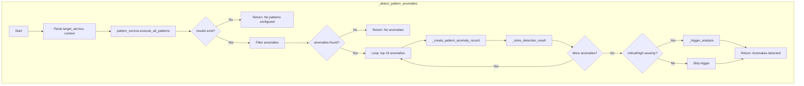
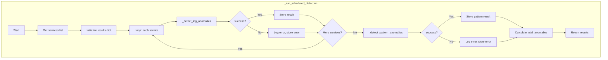
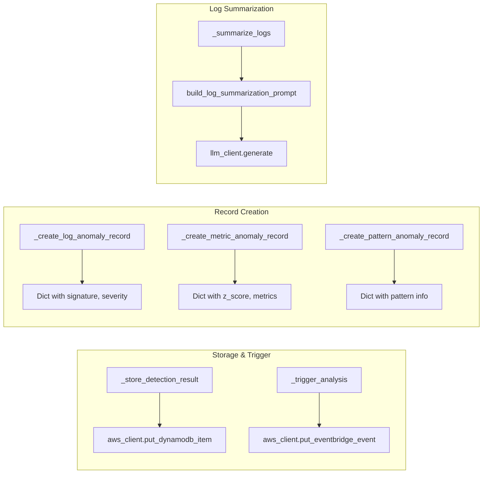
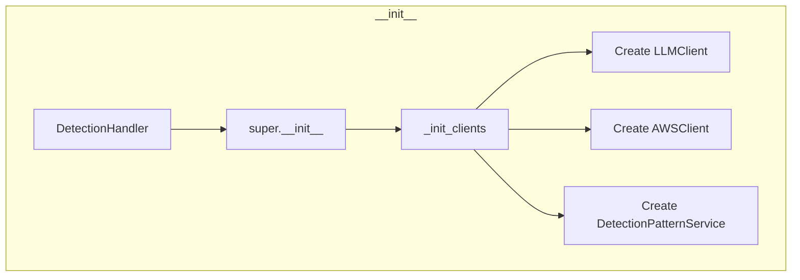

# DetectionHandler 실행 흐름

## Overview

`handler.py`는 BDP Agent의 이상 탐지 Lambda 진입점으로, 4가지 탐지 유형을 처리합니다.

## 메인 실행 흐름

## 상세 메서드 흐름

### 1. Log Anomaly Detection

### 2. Metric Anomaly Detection

### 3. Pattern Anomaly Detection

### 4. Scheduled Detection

## 공통 헬퍼 메서드

## 클래스 초기화 흐름

## 데이터 흐름 요약

| Detection Type | Data Source | Anomaly Criteria | Trigger Condition |
|---------------|-------------|------------------|-------------------|
| log_anomaly | CloudWatch Logs | Error patterns found | `len(logs) >= 5` |
| metric_anomaly | CloudWatch Metrics | `abs(z_score) > 2.0` | Always on anomaly |
| pattern_anomaly | RDS Patterns | Pattern match | `severity in (critical, high)` |
| scheduled | All above | Combined | Delegated to sub-detectors |
