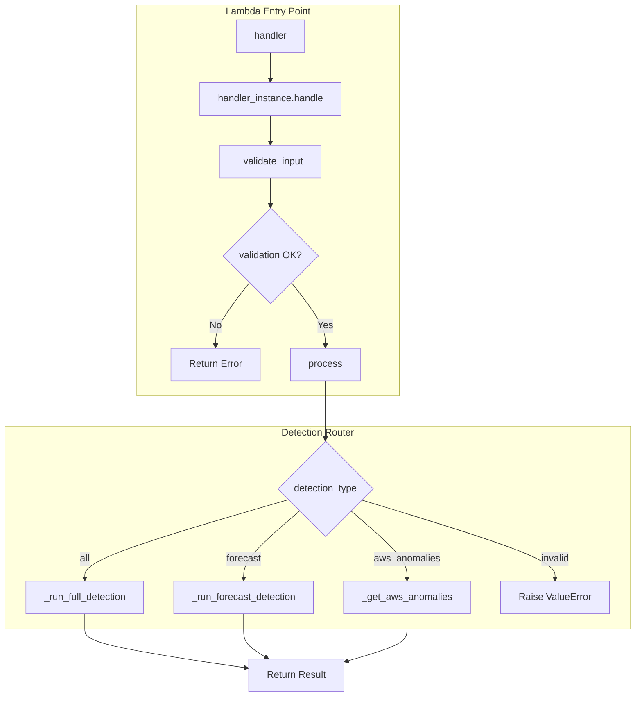
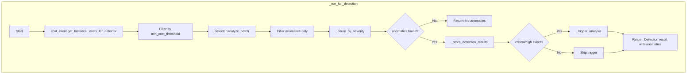
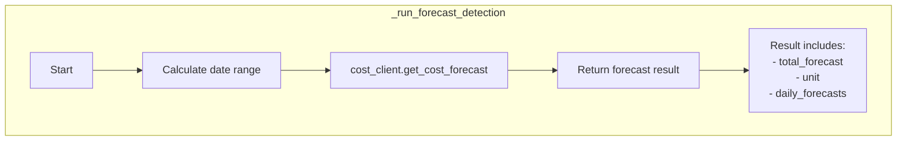
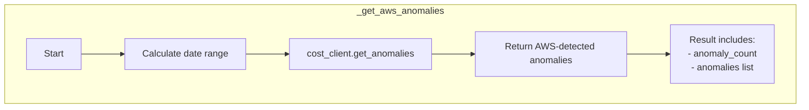
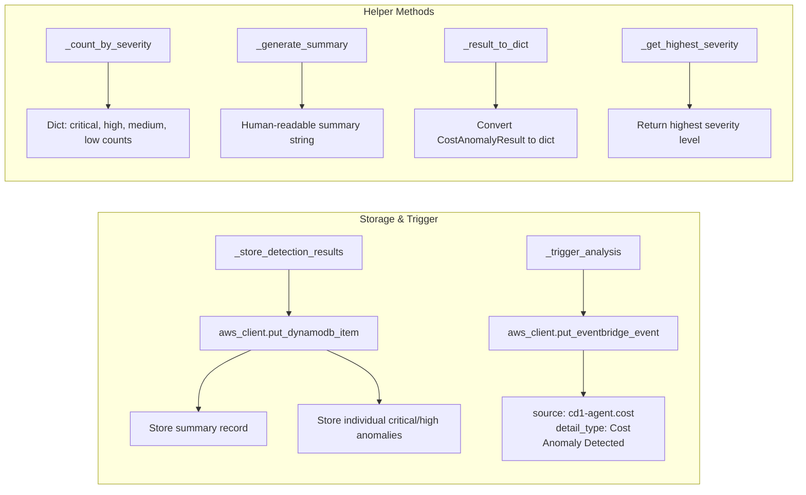
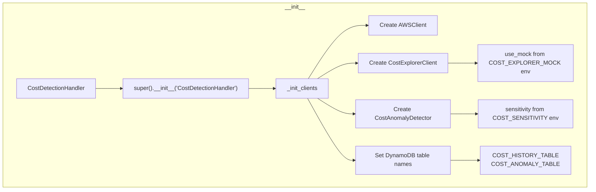

# CostDetectionHandler 실행 흐름

## Overview

`handler.py`는 Cost Agent의 비용 이상 탐지 Lambda 진입점으로, 3가지 탐지 유형을 처리합니다:
- **Full Detection (all)**: Luminol 기반 비용 이상 탐지
- **Forecast**: AWS Cost Explorer 예측
- **AWS Anomalies**: AWS 네이티브 이상 탐지 서비스 조회

## 메인 실행 흐름

## 상세 메서드 흐름

### 1. Full Detection (`_run_full_detection`)

### 2. Forecast Detection (`_run_forecast_detection`)

### 3. AWS Anomalies (`_get_aws_anomalies`)

## 공통 헬퍼 메서드

## 클래스 초기화 흐름

## 데이터 흐름 요약

| Detection Type | Data Source | Anomaly Criteria | Trigger Condition |
|---------------|-------------|------------------|-------------------|
| all (full) | Cost Explorer Historical Data | Luminol-based detection (ratio, stddev, trend) | `severity in (critical, high)` |
| forecast | Cost Explorer Forecast API | N/A (예측 데이터 반환만) | N/A |
| aws_anomalies | AWS Cost Anomaly Detection | AWS 네이티브 탐지 결과 | N/A |

## 탐지 알고리즘

Full Detection에서 사용하는 `CostAnomalyDetector`는 다음 방식으로 이상을 탐지합니다:

| Method | Description | Threshold |
|--------|-------------|-----------|
| Ratio-based | 전일 대비 급격한 변화 | configurable |
| Standard deviation | 통계적 이상치 | z-score based |
| Trend detection | 트렌드 대비 이탈 | configurable |
| Luminol | 시계열 고급 분석 | sensitivity-based |

## 환경 변수

| Variable | Default | Description |
|----------|---------|-------------|
| COST_EXPLORER_MOCK | true | Mock 모드 사용 여부 |
| COST_SENSITIVITY | 0.7 | 이상 탐지 민감도 (0-1) |
| COST_HISTORY_TABLE | bdp-cost-history | 비용 이력 테이블 |
| COST_ANOMALY_TABLE | bdp-cost-anomaly-tracking | 이상 추적 테이블 |
