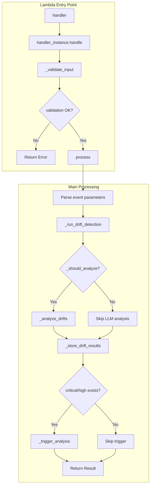
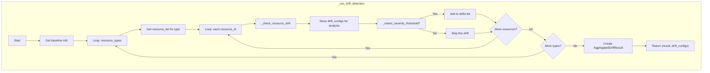
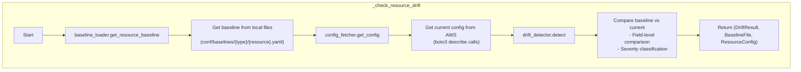
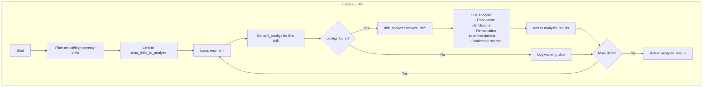
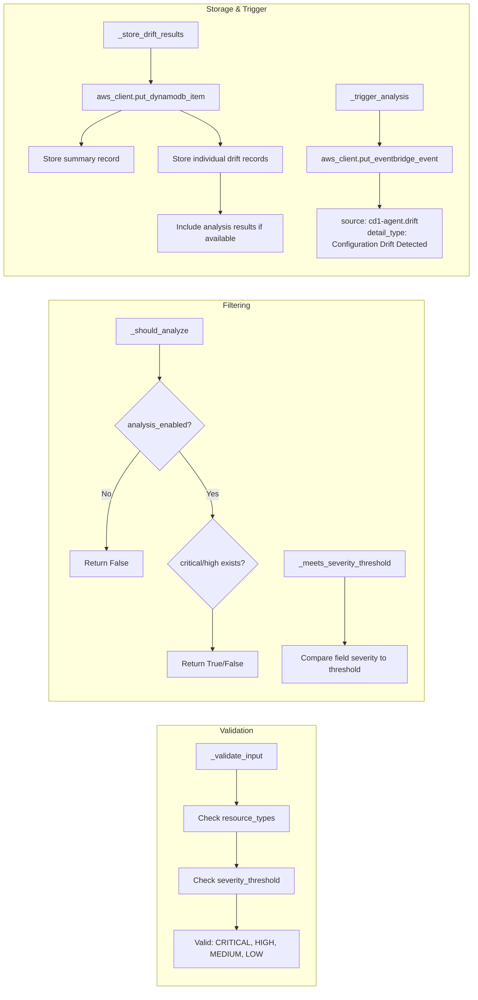
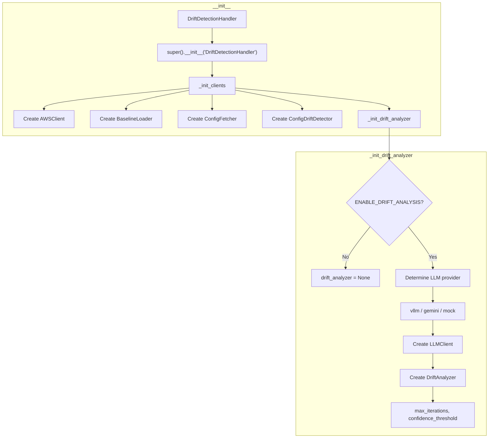

# DriftDetectionHandler 실행 흐름

## Overview

`handler.py`는 Drift Agent의 AWS Configuration Drift Detection Lambda 진입점으로, 다음 기능을 수행합니다:
- **Baseline 비교**: 로컬 baseline 파일과 현재 AWS 리소스 설정 비교
- **Drift 탐지**: 설정 변경(drift) 식별 및 심각도 분류
- **LLM 분석**: Critical/High 심각도 drift에 대한 근본 원인 분석
- **지원 리소스**: EKS, MSK, S3, EMR, MWAA

## 메인 실행 흐름



## 상세 메서드 흐름

### 1. Drift Detection (`_run_drift_detection`)



### 2. Resource Drift Check (`_check_resource_drift`)



### 3. LLM Analysis (`_analyze_drifts`)



## 공통 헬퍼 메서드



## 클래스 초기화 흐름



## 데이터 흐름 요약

| Resource Type | Data Source | Drift Detection | Trigger Condition |
|--------------|-------------|-----------------|-------------------|
| EKS | describe_cluster, describe_nodegroup | Field-level comparison | `CRITICAL or HIGH severity` |
| MSK | describe_cluster | Field-level comparison | `CRITICAL or HIGH severity` |
| S3 | get_bucket_* APIs | Security/lifecycle config | `CRITICAL or HIGH severity` |
| EMR | describe_cluster | Cluster/instance config | `CRITICAL or HIGH severity` |
| MWAA | get_environment | Environment config | `CRITICAL or HIGH severity` |

## Drift Severity 기준

| Severity | Examples | Description |
|----------|----------|-------------|
| CRITICAL | Security group 변경, IAM 정책 변경 | 즉시 조치 필요 |
| HIGH | 네트워크 설정, 암호화 설정 변경 | 빠른 검토 필요 |
| MEDIUM | 리소스 크기, 인스턴스 타입 변경 | 계획된 검토 |
| LOW | 태그, 설명 변경 | 정보 목적 |

## LLM Analysis 출력 구조

```json
{
  "drift_id": "EKS:production-eks",
  "cause_analysis": {
    "category": "manual_change|automation|drift|unknown",
    "root_cause": "상세 원인 설명"
  },
  "confidence_score": 0.85,
  "urgency_score": 0.9,
  "requires_human_review": true,
  "remediations": [
    {
      "action": "remediation action",
      "priority": "high",
      "estimated_impact": "..."
    }
  ]
}
```

## DynamoDB 저장 구조

### Summary Record
```
PK: DRIFT#{date}
SK: DETECTION#{timestamp}
```

### Individual Drift Record
```
PK: DRIFT#{resource_type}#{resource_id}
SK: DRIFT#{timestamp}
```

Analysis 결과가 있는 경우 추가 필드:
- `analysis_cause_category`
- `analysis_root_cause`
- `analysis_confidence`
- `analysis_urgency`
- `analysis_requires_review`
- `analysis_remediations`

## EventBridge 이벤트 구조

```json
{
  "source": "cd1-agent.drift",
  "detail-type": "Configuration Drift Detected",
  "detail": {
    "signature": "drift_{date}",
    "anomaly_type": "config_drift",
    "service_name": "drift-agent",
    "agent": "drift",
    "severity": "critical|high|medium|low",
    "summary": "Configuration drift detected: X drifts across Y resources",
    "drift_details": [...],
    "severity_summary": {...},
    "baseline_info": {...},
    "analysis_enabled": true,
    "analysis_count": 3,
    "analysis_summary": [...]
  }
}
```

## 환경 변수

| Variable | Default | Description |
|----------|---------|-------------|
| ENABLE_DRIFT_ANALYSIS | true | LLM 분석 활성화 여부 |
| LLM_PROVIDER | mock | LLM 제공자 (vllm/gemini/mock) |
| VLLM_ENDPOINT | - | vLLM 서버 엔드포인트 |
| LLM_MODEL | - | 사용할 LLM 모델명 |
| GEMINI_API_KEY | - | Gemini API 키 |
| VLLM_API_KEY | - | vLLM API 키 |
| MAX_ANALYSIS_ITERATIONS | 3 | 분석 반복 최대 횟수 |
| ANALYSIS_CONFIDENCE_THRESHOLD | 0.7 | 분석 신뢰도 임계값 |
| MAX_DRIFTS_TO_ANALYZE | 5 | 분석할 최대 drift 수 |
