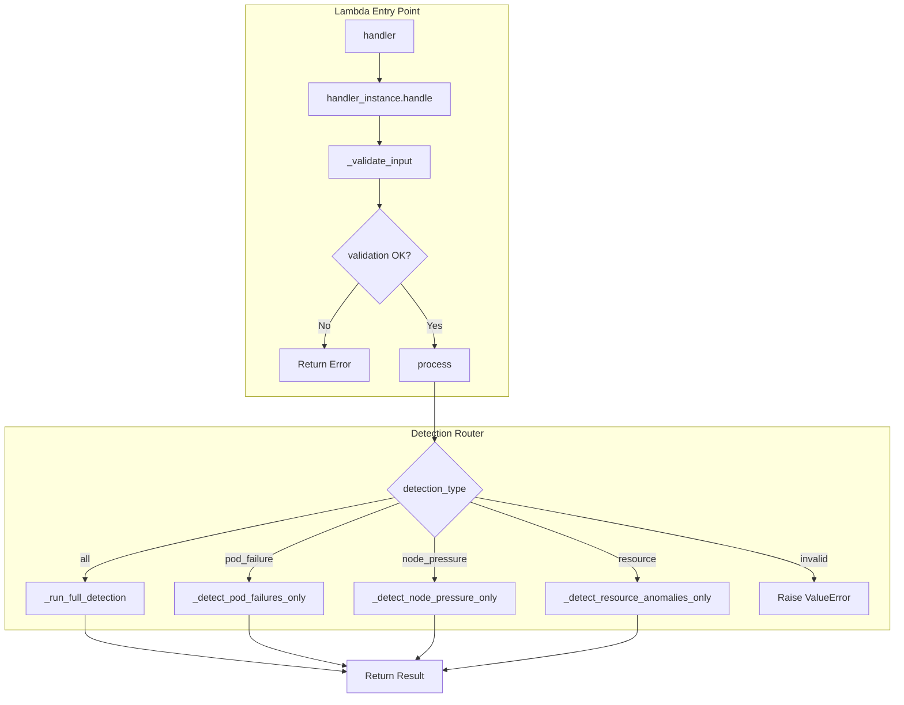
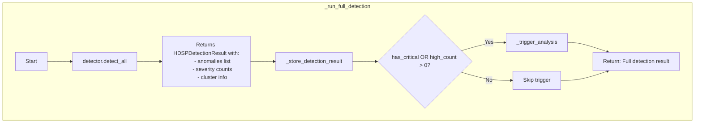
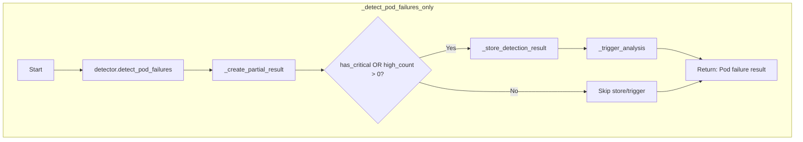
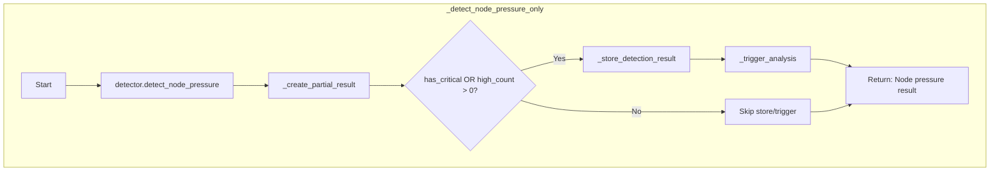
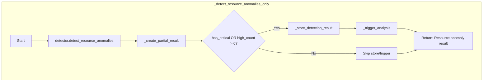
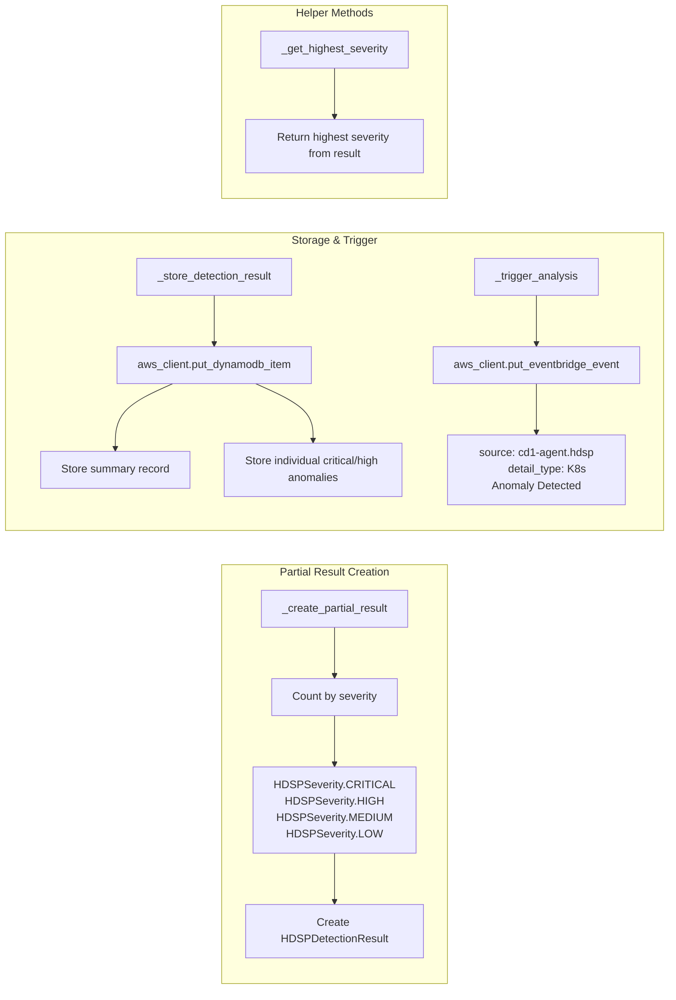
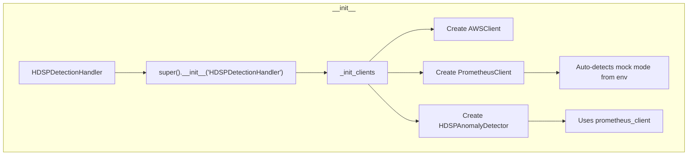

# HDSPDetectionHandler 실행 흐름

## Overview

`handler.py`는 HDSP Agent의 On-Prem K8s 이상 탐지 Lambda 진입점으로, 4가지 탐지 유형을 처리합니다:
- **Full Detection (all)**: 모든 K8s 이상 탐지
- **Pod Failure**: Pod 장애 탐지 (CrashLoopBackOff, OOMKilled, restarts)
- **Node Pressure**: 노드 상태 이상 탐지 (MemoryPressure, DiskPressure, NotReady)
- **Resource**: 리소스 사용량 이상 탐지 (high CPU/Memory usage)

## 메인 실행 흐름



## 상세 메서드 흐름

### 1. Full Detection (`_run_full_detection`)



### 2. Pod Failure Detection (`_detect_pod_failures_only`)



### 3. Node Pressure Detection (`_detect_node_pressure_only`)



### 4. Resource Anomaly Detection (`_detect_resource_anomalies_only`)



## 공통 헬퍼 메서드



## 클래스 초기화 흐름



## 데이터 흐름 요약

| Detection Type | Data Source | Anomaly Criteria | Trigger Condition |
|---------------|-------------|------------------|-------------------|
| all (full) | Prometheus Metrics | Combined pod/node/resource checks | `has_critical OR high_count > 0` |
| pod_failure | Prometheus Metrics | CrashLoopBackOff, OOMKilled, high restarts | `has_critical OR high_count > 0` |
| node_pressure | Prometheus Metrics | MemoryPressure, DiskPressure, NotReady | `has_critical OR high_count > 0` |
| resource | Prometheus Metrics | High CPU/Memory usage thresholds | `has_critical OR high_count > 0` |

## 탐지 알고리즘

`HDSPAnomalyDetector`가 탐지하는 이상 유형:

### Pod Failure Detection
| Metric | Description | Severity |
|--------|-------------|----------|
| CrashLoopBackOff | Pod가 반복적으로 crash | CRITICAL |
| OOMKilled | 메모리 부족으로 kill | HIGH |
| High restart count | 재시작 횟수 임계치 초과 | MEDIUM-HIGH |

### Node Pressure Detection
| Metric | Description | Severity |
|--------|-------------|----------|
| MemoryPressure | 노드 메모리 압박 | HIGH |
| DiskPressure | 노드 디스크 압박 | HIGH |
| NotReady | 노드 Ready 상태 아님 | CRITICAL |

### Resource Anomaly Detection
| Metric | Description | Threshold |
|--------|-------------|-----------|
| CPU Usage | Container CPU 사용률 | configurable |
| Memory Usage | Container Memory 사용률 | configurable |

## DynamoDB 저장 구조

### Summary Record
```
PK: HDSP#{cluster_name}#{date}
SK: DETECTION#{timestamp}
```

### Individual Anomaly Record
```
PK: ANOMALY#{signature}
SK: HDSP#{timestamp}
signature: hdsp_{anomaly_type}_{namespace}_{resource_name}
```

## EventBridge 이벤트 구조

```json
{
  "source": "cd1-agent.hdsp",
  "detail-type": "K8s Anomaly Detected",
  "detail": {
    "signature": "hdsp_{cluster}_{date}",
    "anomaly_type": "k8s_anomaly",
    "service_name": "hdsp-{cluster}",
    "agent": "hdsp",
    "cluster_name": "...",
    "severity": "critical|high|medium|low",
    "summary": "...",
    "anomaly_details": [...],
    "metrics_snapshot": {...}
  }
}
```
